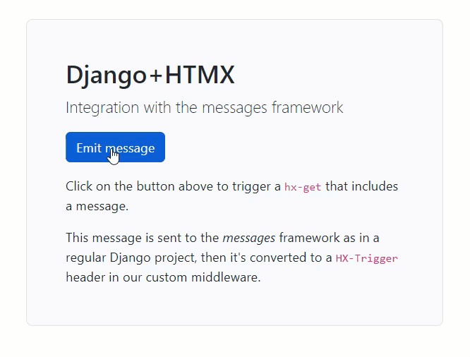

Django+HTMX: integration with the messages framework
===

This repository demonstrates how to use [Django's messages framework](https://docs.djangoproject.com/en/4.1/ref/contrib/messages/) with [HTMX](https://htmx.org/).

<p align="center">
  <a href="https://youtu.be/I5_g7XYyemQ" target="_blank">
    
  </a>
</p>

:tv: **[See the tutorial on YouTube](https://youtu.be/I5_g7XYyemQ)** :tv:


## How to run the demo?

```
pipenv install
pipenv run server
```

(No need to run `migrate` since this project doesn't use the database)

## How does it work?

Here are the two important pieces of this puzzle:

1. [HtmxMessageMiddleware](/htmx_messages/middleware.py) takes the messages and puts them in the `HX-Trigger` header
2. [toast.js](/htmx_messages/static/toasts.js) listens to the `messages` event and shows the messages as toasts.

## How to use this in your project?

1. Copy the `htmx_messages/` folder into your project
2. Add `htmx_messages` in the `INSTALLED_APPS` setting
3. Add `` in near the end of `<body>`
4. Add `<script src=""></script>` as the last element of `<body>`

The files `toast.html` and `toast.js` are tailored for Bootstrap 5; **you'll have to modify them** to suit your needs.