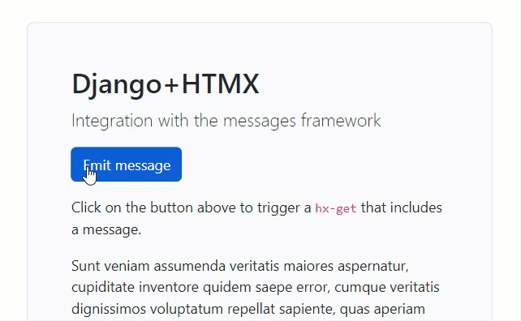

Django+HTMX: integration with the messages framework
===

This repository demonstrates how to use [Django's messages framework](https://docs.djangoproject.com/en/4.1/ref/contrib/messages/) with [HTMX](https://htmx.org/).

This branch shows the "OOB swap" technique, you can find the `HX-Trigger` technique in the [`hx-trigger` branch](https://github.com/bblanchon/django-htmx-messages-framework/tree/hx-trigger).

<p align="center">
  <a href="https://youtu.be/I5_g7XYyemQ" target="_blank">
    
  </a>
</p>

## How to run the demo?

```
pipenv install
pipenv run server
```

(No need to run `migrate` since this project doesn't use the database)

## How does it work?

A custom middleware pulls the messages and appends the toasts' HTML to the response.

:tv: **[See the video on YouTube](https://youtu.be/dc4fhli61bQ)** :tv:

:newspaper: [Read the article on my blog](https://blog.benoitblanchon.fr/django-htmx-messages-framework-oob/) :newspaper: 


## How to use this in your project?

1. Copy the `htmx_messages/` folder into your project
2. Add `htmx_messages` in the `INSTALLED_APPS` setting
3. Add `` in near the end of `<body>`
4. Add `<script src=""></script>` as the last element of `<body>`

The files `toasts.html` and `toast.js` are tailored for Bootstrap 5; **you'll have to modify them** to suit your needs.